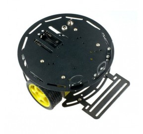
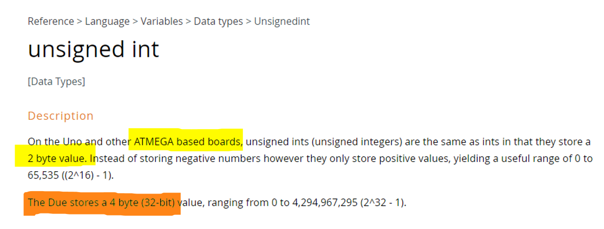
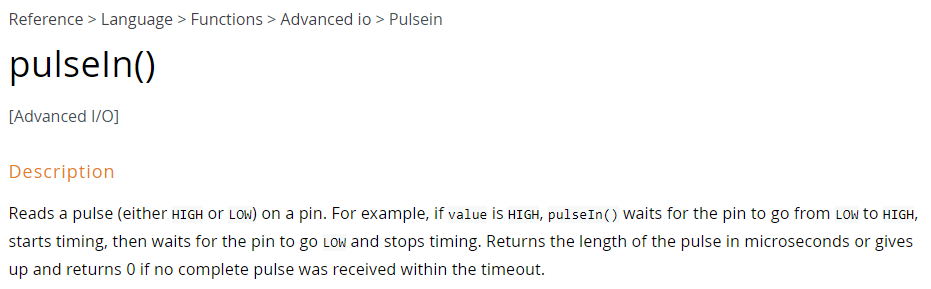

# Codes sources de la conférence : Fonctions Bloquantes VS Réactivité des robots Mobiles

Conférence présentée par [Nao974] pour [Robotic974] chez [EPITECH Réunion] le 15/11/2022 en présence des étudiants de 1ere à 3eme année.

Ce dépôt reprend les grandes lignes de la conférence et les différents codes sources présentés.

La carte mentale servant à la présentation est disponible ici : [Carte Mentale]

# Introduction

En partant d'un exemple simple de véhicule à guidage automatique nous allons voir l'impact des fonctions bloquantes sur la réactivité de celui-ci.

## Mais en 1er lieu, c'est quoi un AGV ?

Un AGV (ou Automatic Guided Vehicle) est un véhicule de transport travaillant sans conducteur (piloté et guidé automatiquement) permettant le transport de matériel principalement dans les usines d'un poste de travail à un autre ou pour l'entreposage.

Il est utilisé généralement en intérieur, mais peut l’être aussi en extérieur (sous certaines conditions) ; il peut transporter des charges légères ou très lourdes (plusieurs tonnes). 

Il peut être guidé de différentes manières.

**Filoguidage** : Fil émetteur d’ondes enfoui, rail métallique au sol, fil électrique noyé au sol… Pour se déplacer, l’AGV suit une piste tracée au sol. Le robot détecte le signal transmis par la piste et le suit, comme s’il était sur une voie ferrée. La mise en place de cette technologie de déplacement ainsi que toute modification du parcours nécessitent des travaux. Le filoguidage est donc adapté aux applications simples sans possibilité de flexibilité

**Optoguidage** : Alternative moins coûteuse et plus simple que le filoguidage, l’optoguidage permet à l’AGV de suivre une ligne peinte au sol, grâce à des caméras embarquées. Cette solution ne permet pas non plus une souplesse optimale, mais ne nécessite pas de travaux de gros œuvre

## Les AMR

Un robot mobile autonome est un type de robot qui peut comprendre et se déplacer dans son environnement de manière indépendante.

Ils utilisent un ensemble sophistiqué de capteurs, de machine learning et de calculs pour planifier la trajectoire, afin d'interpréter et de naviguer dans leur environnement.

**Laserguidage** : Ce système permet à l’AMR de se mouvoir grâce à un maillage de réflecteurs intégrés dans son environnement. Equipé d’un laser tournant, le robot se déplace grâce au principe de l’odométrie, et précise sa trajectoire grâce aux réflecteurs. La combinaison de ces deux technologies permet aux AMR de s’orienter avec précision. En outre, il est possible de modifier facilement le circuit du robot, grâce aux logiciels de supervision inclus dans le système.

**Géoguidage** : Ce système se base sur une cartographie des installations et ne requiert ni aménagement d’infrastructure, ni travaux. L’AMR parvient à se repérer de façon autonome et est en mesure de calculer son trajet automatiquement. L’avantage, c’est qu’il est possible à tout moment de modifier la cartographie de l’environnement dans lequel évolue le robot.

Les MCU (Micro Controller Unit) sont principalement utilisés dans les systèmes autonomes. Dans la suite de cette présentation, nous simplifierons un système embarqué comme un système autonome mais en déplacement.

**Le choix** de l'AGV ou de l'AMR se fera en fonction de : 
- de la topologie du lieu
- du besoin ou non de modifier le tracé
- de l'autonomie (au sens prise de décision)
- du degré de collaboration souhaité

## Quelques photos

A vous de faire la différence entre un AGV et un ARM :wink:
<p>  </p>

# Mise en Oeuvre de notre AGV

Voici les composants utilisés pour notre démonstration.

## Arduino

Ce n'est pas simplement le nom d'une carte à base de microcontrôleur.

L’Arduino est un projet inventé en 2005 par une équipe italienne de l’Institut du Design d’Interaction d’Ivrea désirant permettre à des étudiants en art et en design de créer tout type de projets grâce à une petite carte électronique que l’on programmerai facilement via un logiciel (Arduino IDE) et où l’on pourrait y brancher des LEDs, des moteurs, des servomoteurs, des capteurs, des éléments électroniques….

Le terme Arduino regroupe :
- Une Fondation qui distribue et publie des cartes à base de MCU en Open source 
- Un IDE
- Un Framework que nous allons utiliser à partir du module Platform.io

*Pour notre AGV, nous utiliserons la carte Arduino Uno à base du MCU ATMEL 328P : https://bentek.fr/2-arduino-uno/

## Motor Shield
Le module Arduino Motor Shield se connecte sur une carte Arduino Uno, et permet de contrôler la vitesse et le sens de rotation de deux moteurs à courant continu  (2A max).

[Fiche Composant Motor-Shield]

## Suiveur de Ligne

Ce capteur est basé sur une LED infra rouge qui va émettre un rayon, et un phototransistor qui devrait recevoir en retour ce rayon réfléchi par une surface plus ou moins clair. La sortie S est digitale, elle prendra 
soit la valeur 5V (VRAI), soit la valeur 0V (FAUX).
Nous en utiliserons deux.

[Fiche Composant Suiveur-Ligne]

## Capteur de Distance Ultrason

Le principe de fonctionnement du capteur est entièrement basé sur la vitesse du son.
Voilà comment se déroule une prise de mesure :
-  Le capteur envoie une série d’impulsions ultrasoniques à 40KHz inaudible pour l'être humain, 
-  Les ultrasons se propagent dans l'air jusqu'à toucher un obstacle et retourne dans l'autre sens vers le 
capteur
-  Le capteur détecte l'écho et clôture la prise de mesure

Placer à l'avant, il permettra de détecter d'éventuels obstacles.

[Fiche Composant Distance-Ultra-Son]

## Le Châssis

Châssis Turtle 2WD constitué d'un plateau métallique rond, de 2 moto-réducteurs, de 2 roues à pneus souples, d'une roue métallique, d'un support de 5 piles 1,5V.

<p>  </p>

# C'est partie pour le Codage
## Outil de Développement

Afin de développer en langage C, compiler et transférer nos prochains codes sources sur notre carte MCU, nous utiliserons l'IDE VSCode avec l'extension [PlatformIO] .

## Codes Sources

L'ensemble des codes sources décrits ci-après se trouvent dans le dossier [./src] de ce même dépôt.

## Organisation des codes sources

Chaque exercice proposé correspond à un programme Arduino indépendant des autres exercices. Néanmoins, pour ne pas avoir à gérer autant de projets PlatformIO qu'il y'a d'exercices, on peut s'arranger pour tous les faire coexister au sein d'un même projet. 

Chaque exercice est traité dans un fichier source portant l'extension `.cpp` et stocké dans le dossier `src`. Par défaut, PlatformIO se charge de compiler tous les fichiers sources qu'il trouve dans le dossier `src`, et notamment le traditionnel `main.cpp`. Aussi, pour modifier ce comportement, il existe une directive très pratique à insérer dans le fichier `platformio.ini` qui va nous permettre d'indiquer précisément ce qu'il faut compiler ou non. Par exemple, si l'on souhaite compiler le programme décrit dans le fichier `01_Suiveur_Ligne.cpp`, et uniquement celui-là, il suffira de le spécifier à l'aide de la directive `src_filter` de la manière suivante :

```ini
[env:uno]
platform   = atmelavr
board 	   = uno
framework  = arduino
src_filter = -<*> +<01_Suiveur_Ligne.cpp>
```

Ici on construit une liste de fichiers à compiler, en commençant par exclure tous les fichiers se trouvant dans le dossier `src` avec la balise `-<*>`, puis en insérant le seul fichier `01_Suiveur_Ligne.cpp` que l'on souhaite compiler avec la balise `+<01_Suiveur_Ligne.cpp>`.

Par conséquent, pour compiler un autre programme, vous devrez préciser le nom du fichier correspondant avec la balise appropriée. Chaque fichier solution est spécifique et indépendant des autres. Vous ne pouvez donc en compiler qu'un seul à la fois.

*Reportez-vous à la documentation officielle de PlatformIO pour plus de détails sur [la directive `src_filter`][src-filter].*

## Quelques Règles de déclaration

### Type des variables

La taille mémoire minimale allouable est 1 octet, donc déclarer un `boolean` est trompeur car en mémoire la variable ne prendra pas 1 bit mais 8 bits (1 octet).

Les différents types d'entier `int` ne sont pas parlant sur leur taille réelle en mémoire, de plus, en fonction du µControleur, il ne prendra pas forcément la même taille en mémoire :

<p>  </p>

Il faut donc privilégier les types décrivant dans leur nom, le nombre de bits utilisés :

- `int8_t`   au lieu du `char`
- `uint8_t`  au lieu du `byte` (char non signé)
- `int16_t`  au lieu du `int`
- `uint32_t` ... 

Nous voyons tout de suite la place utilisée en mémoire. 

### Déclaration des constantes

Il convient de ne pas utiliser  `#define` car le type de la constante n'est pas défini.

Privilégier la déclaration :
```c++
const uint8_t NB_LED = 8;
```  

### Variable Globale

Notre code est un petit exemple, les variables globales déclarées sont utilisées dans le `setup()` et le `loop()`, nous pouvons donc les laisser en globale mais il convient de bien comprendre le fonctionnement de la mémoire : https://quai-lab.com/arduino-ses-memoires

## **01_Suiveur_ligne.cpp**

Petit programme permettant de valider notre prototype.

Le dossier `\lib` contient la librairie permettant de contrôler les deux moteurs à partir du Motor Shield.
[Fiche Composant Motor-Shield]

`motorLeft` et `motorRight` sont instanciés à partir de la classe `MotorShield` ayant 3 méthodes publiques :

- Initialiser les broches Arduino pour le pilotage du moteur
```c++
        void init(uint8_t pinDIR, uint8_t pinBRAKE, uint8_t pinCMD);
```
- Envoyer la consigne de vitesse au moteur. Une valeur négative fait tourner le moteur en sens inverse.
```c++
        void speed(int16_t speed);
```
- Frein moteur
```c++
        void stop();
```

Les deux capteurs de Suivi de ligne sont digitaux, il suffit d'initialiser les broches de l'Arduino en entrée :
```c++
pinMode(PIN_LINE_LEFT, INPUT);
``` 
Puis lire l'état de ces broches dans la boucle principale :
```c++
uint8_t lineLeft = digitalRead(PIN_LINE_LEFT);
```

Si la valeur est `true`, le capteur est sur la ligne noire.

De simples conditions imbriquées permettent de tourner à gauche, à droite ou aller tout droit en fonction des valeurs retournées par ces 2 capteurs gauche / droit.

Résultat, notre AGV suit la ligne noire sans aucun problème :
<p>  </p>

## **02_Lecture_Distance_pulseIn.cpp**

Notre AGV se déplace en suivant la ligne comme un vrai dans une usine, c'est super !!! mais si un humain passe devant .... ben là .... ça fait mal.

Donc nous devons détecter si un obstacle et devant notre AGV et dans ce cas l'arrêter.

Nous allons utiliser le capteur HC-SR04 qui est le standard des capteurs à base d'ultra son.

Voici la fiche afin de comprendre le fonctionnement :  [Fiche Composant Suiveur-Ligne]

Nous allons donc initialiser en `Sortie` la broche branchée sur TRIGGER, et en `Entrée` la broche connectée sur ECHO.
```cpp
pinMode(TRIG, OUTPUT);
pinMode(ECHO, INPUT);
```
Puis générer le signal TRIGGER avec un passage à l'état `HAUT` de 10µs.
```cpp
digitalWrite(TRIG, HIGH);
delayMicroseconds(10);
digitalWrite(TRIG, LOW);
```
Nous pouvons maintenant mesurer le temps à l'état de la broche ECHO avec la fonction `pulseIn()` et la convertir en centimètre.
```cpp
distance = US2CM * pulseIn(ECHO, HIGH);
```
<p>  </p>

Le coefficient US2CM permet de convertir le temps en 
µs vers des centimètres.
- Sachant que la vitesse du son à 24° est de 344 mètres par seconde
- Le signal va faire un aller puis un retour donc à diviser par deux
```cpp 
const float US2CM = .017300; // 24°C 
```

En cadeau, une calculette pour convertir la durée en distance et inversement : [Calculette_Duree-Distance]

## **03_Suiveur_Ligne+Distance_pulseIn.cpp**

Il suffit de prendre le 1er programme et rajouter notre mesure de distance.

- Si la distance est > 20 cm alors on avance.
- Sinon on stop l'AGV.
```cpp 
else {
        motorLeft.stop();
        motorRight.stop();
}
```

<p>  </p>

<font color="red"><h2>Y a comme un problème</h2></font>
On dirait que l'AGV à bu.... il ne suit plus la ligne.

La fonction pulseIn() est bloquante, elle peut attendre plus de 145 ms (voir indéfiniment) que la broche ECHO repasse à l'état bas en cas d'absence d'obstacle.

Cela bloque la boucle principale, dans l'attente l'AGV avance suivant la dernière commande reçue.

Il perd alors la ligne noire et tourne sur lui-même.

Nous pouvons rajouter un `timeout` lors de l'appel de la fonction `pulseIn()`mais cela engendre un autre problème dans lequel nous allons envoyer une nouvelle trame d'ultra-son alors que la précédente est susceptible de revenir, et donc fausser la mesure.

Mais nous avons une autre solution !!!

## **04_Lecteure_Distance_interrupt.cpp**

Nous allons descendre d'un cran dans le matériel, les interruptions sont spécifiques à chaque microcontrôleur et sont *branchées* différemment d'une carte à une autre. 

Il convient de récupérer différents documents qui nous serviront à trouver la bonne broche en fonction de l'interruption souhaitée.
- le DataSheet du micro Controleur afin de trouver la bonne interruption : [Atmel 328P]
- le Schéma PINOUT décrivant chaque broche de la carte afin de retrouver notre broche d'interruption externe : [PINOUT Arduino Uno]

### **Une interruption, c'est quoi ?**

Une interruption, comme son nom l’indique, consiste à interrompre momentanément le programme principal en cours d'exécution afin d'effectuer une autre action.
Une sauvegarde des différents registres est effectuéé au préalable, quand cette action est terminée, le microcontrôleur restaure les registres et retourne à l’exécution du programme principal à l’endroit exact où il l’avait laissé.

Il existe différentes interruptions : 
- internes au microcontrôleur provenenant des `Timers`, `Watchdog`, `UART`, `I2C`, etc... 
- externes par le changement d'état de broches spécifiques.

Pour le 1er cas, je vous laisse reprendre le support du précèdent Talk traitant des `Timers`: https://github.com/Nao974/Conference_Optimiser_son_code_sur_MCU

**Mon aide-mémoire sur les interruptions de l'ATMEL 328P :** [Carte Mentale ISR] 

Nous allons donc nous intéresser aux interruptions dites externes, car le déclencheur se trouvera en dehors du microcontrôleur.

### **Les interruptions externes**
Là encore, il convient de distinguer deux types d'interruptions externes : 
- **INTx** les plus complètes avec 4 modes de déclenchements différents et rattachées à une broche spécifique, mais aux nombres de 2 seulement sur l'ATMEL 328P
- **PCINTx** `Pin Change Interrupt` rattachées non plus à une broche mais à un port complet. Il conviendra donc de faire une discrimation dans l'interruption afin de connaitre la broche ayant levée l'interruption

### **Rappel de notre besoin**
Afin de mesurer la distance d'un objet à partir de notre capteur HC-SR04, nous devons mesurer le temps passé à l'état `HAUT` de la broche `ECHO`.

Opérations à effectuer : 
- Lors du passage à l'état `HAUT` de la broche `ECHO`
   - mémorisation du temps *T1* correspondant au départ de la mesure
- Lors du passage à l'état `BAS` de la broche `ECHO`
   - mémorisation du temps *T2* correspondant à la fin de la mesure

Il nous suffira de faire *T2 - T1* pour avoir le temps passé à l'état `HAUT` par la broche `ECHO`.

Nous allons pour cela utiliser le vecteur d'interruption INT0 sur la broche 2 en mode `CHANGE`.

Ce document n'est pas un cours complet sur la gestion des interruptions, merci de vous reporter
- à la [Carte Mentale ISR] pour le détail du fonctionnement des interruptions 
- et l'atelier https://github.com/Robotic974/atmega328p-registers-and-interrupts pour la mise en pratique. 

Vous trouverez dans le dossier `\include` le code commenté spécifique à l'implémentation d'un capteur `HC-SR04` sur *Arduino Uno*.

## **05_Suiveur_Ligne+Distance_interrupt.cpp**

Il nous suffit maintenant d'intégrer notre gestion du capteur `HC-SR04` dans notre programme de Suiveur de ligne.

On instancie notre capteur à partir de la structure décrite dans notre librairie, le constructeur va initialiser le sens des broches et rattacher la routine d'interruption au vecteur :
```cpp
    sr04(uint8_t trigger, uint8_t echo) {
        pinMode(pin_trigger=trigger, OUTPUT);
        pinMode(pin_echo=echo, INPUT);

        attachInterrupt(digitalPinToInterrupt(pin_echo), HC04Isr, CHANGE);
    }
```

Dans notre boucle on vérifie si la lecture de distance est terminée, dans ce cas nous la durée à l'état `HAUT` de la broche `ECHO`, conversion en centimètre puis relance d'une nouvelle mesure : 
```cpp
    if (finished) {
    // calcule de la durée de ECHO à l'état haut
        duration  = end_us - start_us;

    // Conversion    
        distance = US2CM * duration;

    // Déclenchement d'une nouvelle mesure
        distanceSensor.start();
        finished= false;
    }
```

Et enfin si la distance est > 20cm alors notre AGV avance, sinon il stop.

<p>  </p>

___

## En Conclusion

Voilà, nous avons maintenant un code performant, sans fonction bloquante dans la boucle principale, notre AGV est réactif.

En Bonus, voici un AGV de type **Optoguidage** avec une analyse d'image effectuée par la caméra [HuskyLens] permettant *d'externaliser* cette analyse très gourmande en ressource, le microcontrôleur ne fait que lire le résultat par liaison I2C.

<p>  </p>

Zoom sur l'analyse d'image avec la conversion de la ligne à suivre en Vecteur : 
<p>  </p>

___

**Bon code à tous !**
___


[EPITECH Réunion]: https://www.epitech.eu/fr/ecole-informatique-la-reunion
[Robotic974]:      https://www.facebook.com/robotic974
[Nao974]:          https://www.youtube.com/@Nao974Robotic

[Carte Mentale]:    https://www.xmind.net/m/crw8Ea
[Carte Mentale ISR]: https://www.xmind.net/m/Sm6Qam

[Fiche Composant Motor-Shield]: assets/S01_Shield_Moteur_R3_base_L298.pdf
[Fiche Composant Suiveur-Ligne]: assets/C01_Suiveur_Ligne_Digital.pdf
[Fiche Composant Distance-Ultra-Son]: assets/C02_Capteur_Distance_Ultrason.pdf

[Calculette_Duree-Distance]: assets/Calculette_Duree-Distance.xlsx

[HuskyLens]: https://www.dfrobot.com/huskylens.html

[Atmel 328P]:      https://ww1.microchip.com/downloads/en/DeviceDoc/Atmel-7810-Automotive-Microcontrollers-ATmega328P_Datasheet.pdf
[PINOUT Arduino Uno]:          assets/pinout_328P.pdf
[digitalWrite()]:  https://garretlab.web.fc2.com/en/arduino/inside/hardware/arduino/avr/cores/arduino/wiring_digital.c/digitalWrite.html
[PlatformIO]:      https://platformio.org/?utm_source=platformio&utm_medium=piohome
[./src]:             src/
